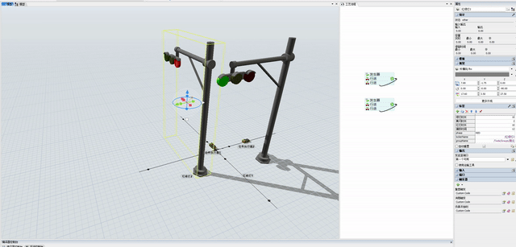

# FlexSim 红绿灯（Traffic Light for FlexSim）
> **Traffic light intersection control for FlexSim — ControlArea occupancy stops AGVs on red, releases them on green. For AGV / port / factory simulation. No ProcessFlow needed.**

一个最简单的 FlexSim 红绿灯：**红灯时占用控制区域，车辆在最近的控制点停下；绿灯时释放，车辆通过**。

> 不需要写代码。装好用户库后拖进自己的模型，放好控制区域就能用。

## 演示



## 核心逻辑（就这些）

| 灯 | 对控制区域做什么 | 车辆 |
|----|----------------|------|
| 红灯 | Locker 占用（锁定）控制区域 | 在最近的控制点停下等待 |
| 绿灯 | 释放（解锁）控制区域 | 通过路口 |
| 黄灯 | 提示即将变化 | 减速停车 |

## 配时怎么算（偏移）

两个灯要"一个绿灯时另一个红灯"，周期必须相等，用偏移时间错开：

```
周期 = 绿灯 + 黄闪 + 红灯
红灯时长 = 周期 - 绿灯 - 黄闪
灯2 的偏移 = 灯1 的（绿灯 + 黄闪）
```

例：灯1 绿灯 23s、黄闪 3s → 灯2 偏移 = 26，灯1 变红时灯2 正好变绿。

## 两个标签：lockerName 和 groupName

灯要知道"红灯时锁哪些控制区域"，就靠这两个标签：

| 标签 | 类型 | 指向 | 作用 |
|------|------|------|------|
| `lockerName` | Pointer | 一个 Locker | 灯用这个 Locker 锁定/释放控制区域 |
| `groupName` | Pointer | 一个 Group | 该方向所有控制区域（ControlArea）所在的组 |

绑定：标签类型选 **Pointer**，从模型树把 Locker 拖进 `lockerName`、把 Group 拖进 `groupName`。复制到别的方向时，只改这两个标签指向新的 Locker/Group，代码不用动。

## 怎么用

**方式一：直接跑模型**

下载 `models/红绿灯.fsm`，用 FlexSim 2026 打开 → Run。

**方式二：装用户库，用在自己的模型里**

1. 下载 `models/trafficlight.fsl`（连同 `models/fbx/` 两个文件）；
2. 安装：把 `trafficlight.fsl` 放到 FlexSim 的 `libraries` 目录，或 **工具 → 全局设置 → 用户库 → 添加**；
3. 打开你自己的模型，在库面板搜 "trafficlight"，把红绿灯拖进场景；
4. 在路口放好控制区域（ControlArea），建一个 Group 把所有控制区放进去、建一个 Locker；
5. 把灯的两个标签 `lockerName`、`groupName` 分别绑定到 Locker 和 Group；
6. 运行。

> 如果灯没有 3D 外观：把 `models/fbx/` 里的 `杆横向.fbx`（灯柱）、`灯0.fbx`（灯体）放到自己电脑上，在灯的外观属性里重新选择即可。

## 代码

想自己搭或改逻辑，直接点开下面的代码文件（可查看、可复制）：

| 类型 | 文件 | 粘贴位置 | 作用 |
|------|------|----------|------|
| 触发器 1 | [OnModelStart.flexscript](code/OnModelStart.flexscript) | 灯 → Triggers → OnModelStart | 启动对时（偏移计算） |
| 触发器 2 | [OnMessage.flexscript](code/OnMessage.flexscript) | 灯 → Triggers → OnMessage | 状态切换 + 红灯锁/绿灯放控制区 |
| 触发器 3 | [OnReset.flexscript](code/OnReset.flexscript) | 灯 → Triggers → OnReset | 复位变灰 |
| 初始化 | [init_lock.flexscript](code/init_lock.flexscript) | Model → Triggers | 启动预锁全部控制区 |

## 文件说明

```
flexsim_trafficlight/
├── models/
│   ├── 红绿灯.fsm        ← 完整模型（打开直接跑）
│   ├── trafficlight.fsl  ← 用户库（装进 FlexSim，拖出来用）
│   └── fbx/              ← 灯柱/灯体 3D 模型（外观用）
├── code/                 ← 代码文件（点链接查看/复制）
└── docs/
    ├── demo-traffic-light.gif   ← 演示动态图
    └── demo-traffic-light.mp4   ← 演示视频
```

## License

[MIT](LICENSE)。FlexSim 是 FlexSim Software Products, Inc. 的商业软件，本仓库仅包含文档与 FlexScript 脚本示例，不含 FlexSim 本体。
